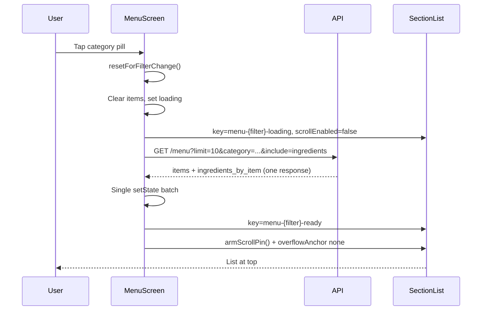

# Menu Page Scroll Fix (Restaurant App)

This document explains how we fixed scroll and category-pill behavior on the **Menu** tab in the restaurant partner app (`frontend/kitchenai-restaurant/`). The **Orders** tab worked correctly; **Menu** jumped to the middle or bottom of the first page when switching category pills, even though both screens used a similar `SectionList` layout.

---

## Symptoms

| Scenario | Expected | Actual (before fix) |
|----------|----------|---------------------|
| First visit to Menu | List starts at top | OK |
| Switch category pill (e.g. All → Starters) | List resets to top | Jumped to ~middle/bottom of first 10 rows |
| Scroll to load more | Loads next page at current scroll position | Sometimes auto-loaded page 2 without user scroll |
| Web reload on `/menu` | Stay on Menu tab | Separate fix in navigation (see [Web deep linking](#web-deep-linking-side-note)) |

The failure was most visible on **Expo web** (port 8082), but the fixes are written for all platforms.

---

## Root cause analysis

We compared Menu and Orders step by step. The shared UI pattern was not the bug—the **data and lifecycle** around Menu were different.

### 1. N+1 ingredient fetches (backend + frontend)

**Orders:** one API call per page.

**Menu (before):** one menu page call, then **one ingredients call per dish** (10 dishes → 11 HTTP requests).

Effects:

- Slower pill switches (more time with stale list on screen)
- Multiple React state updates (`setItems`, then `setIngredientsByItem`)
- Row height changes when ingredient text appeared (`MenuListItem` ingredient line)
- `SectionList` relayout and scroll anchoring on web

### 2. Client-side re-sort on every update

**Orders:** when search is empty, `filteredOrders` returns the **`orders` array reference** directly.

**Menu (before):** `sortedItems = [...items].sort(...)` on every `items` change—a **new array every time**, even when order did not change. That forced `SectionList` to treat data as changed and disturbed scroll position.

On append (load more), re-sorting by name also **reordered rows** relative to API cursor order (`category`, `name`, `menu_item_id`), breaking pagination consistency.

### 3. `onEndReached` firing without user scroll

With `onEndReachedThreshold={0.35}`, a page of 10 rows often does not fill the viewport. On mount or after a pill switch, `onEndReached` can fire immediately.

If the list briefly reports a non-zero scroll offset (web quirk), the hook thinks the user scrolled and **loads page 2**, which looks like landing at the “bottom of the first batch.”

### 4. Stale fetch race on fast pill switching

`useEffect([fetchPage])` had **no request generation guard**. Sequence:

1. User on **All** — fetch A in flight  
2. User taps **Starters** — fetch B starts  
3. Fetch A completes after B — applies wrong items, toggles `loading`, remounts list  
4. Fetch B completes — correct data, second layout pass, scroll jump  

Orders had the same pattern but fewer pills and faster responses, so the race was rarer on Menu.

### 5. Web scroll anchoring on pill switch (main pill-switch bug)

Initial load worked because the list **mounted fresh** (spinner → new `SectionList`).

Pill switch initially **kept the same scroll container** while clearing/refilling data. On web, **`overflow-anchor`** (scroll anchoring) tries to keep visible content stable when DOM height changes. When items were cleared and replaced, the browser adjusted `scrollTop` to “maintain” position—often landing around the middle of the new first page.

This did not affect Orders as badly (simpler rows, no ingredient layout shift, fewer category pills).

---

## Solution overview

We fixed Menu in three layers:

1. **Backend** — batch ingredients into the menu list response  
2. **Frontend data flow** — align with Orders (stable references, single update per page, fetch generation)  
3. **Frontend scroll** — shared hook + web-specific pinning (borrowed from consumer pantry screen)



---

## Backend changes

### Batch ingredients in list endpoint

**Endpoint:** `GET /api/v1/restaurant/{kitchenId}/menu`

**New query param:** `include=ingredients`

**New response field:** `ingredients_by_item` — map of `menu_item_id` → `RecipeIngredient[]`

**Files:**

| File | Change |
|------|--------|
| `backend/internal/restaurant/services/types.go` | `MenuListPage.IngredientsByItem`, `ListMenuParams.IncludeIngredients` |
| `backend/internal/restaurant/services/menu.go` | `loadRecipeIngredientsForMenuItems()` — single SQL with `ANY($2::uuid[])` |
| `backend/internal/restaurant/transport/http/handlers.go` | Parse `include=ingredients` |

Example request:

```http
GET /restaurant/{kitchenId}/menu?limit=10&active=true&include=ingredients&category=starters
```

Example response shape:

```json
{
  "items": [ /* MenuItem[] */ ],
  "next_cursor": "starters|Soup|uuid",
  "has_more": true,
  "total_count": 42,
  "category_counts": { "starters": 8, "mains": 20 },
  "ingredients_by_item": {
    "menu-item-uuid": [
      { "ingredient_name": "Tomato", "qty": 2, "unit": "kg" }
    ]
  }
}
```

This removed the frontend `fetchIngredientsMap()` N+1 helper entirely.

---

## Frontend changes

### 1. `MenuScreen.tsx` — data flow (match Orders)

**Stable list data when search is empty:**

```ts
const filteredItems = useMemo(() => {
  if (!searchLower) return items; // same reference as Orders pattern
  return items.filter(/* search name + ingredients */);
}, [items, ingredientsByItem, searchLower]);
```

**No client re-sort** — trust API order (`ORDER BY category, name, menu_item_id`).

**Single fetch with ingredients:**

```ts
const params = new URLSearchParams({
  limit: String(MENU_PAGE_SIZE),
  active: 'true',
  include: 'ingredients',
});
```

**Fetch generation guard** — ignore stale responses:

```ts
const fetchGenRef = useRef(0);

useEffect(() => {
  const gen = ++fetchGenRef.current;
  setLoading(true);
  fetchPage(undefined, false, gen).finally(() => {
    if (gen !== fetchGenRef.current) return;
    setLoading(false);
    setHasLoadedOnce(true);
  });
}, [fetchPage]);

// Inside fetchPage, before setState:
if (!append && gen != null && gen !== fetchGenRef.current) return;
```

**Pill switch handler:**

```ts
const selectGroupFilter = (filter: string | null) => {
  if (filter === groupFilter) return;
  resetForFilterChange();
  setItems([]);
  setIngredientsByItem({});
  setLoading(true);
  setGroupFilter(filter);
};
```

### 2. `MenuScreen.tsx` — list lifecycle (initial load vs pill switch)

| Phase | Behavior |
|-------|----------|
| **First load** | Full-screen spinner until first fetch (`loading && !hasLoadedOnce`) |
| **Pill switch** | Keep list area mounted; remount scroll surface via `key`; disable scroll while loading |

```ts
const listMountKey = `menu-${filterKey}-${loading ? 'loading' : 'ready'}`;

{loading && !hasLoadedOnce ? (
  <ActivityIndicator />
) : (
  <SectionList
    key={listMountKey}
    scrollEnabled={!loading}
    contentContainerStyle={[
      /* ... */,
      Platform.OS === 'web' ? { overflowAnchor: 'none' } : null,
    ]}
  />
)}
```

- **`key={listMountKey}`** — new scroll container per filter + loading phase (clears web scroll state)  
- **`scrollEnabled={!loading}`** — no user scroll during fetch  
- **`overflowAnchor: 'none'`** — disables browser scroll anchoring on web ([CSS overflow-anchor](https://developer.mozilla.org/en-US/docs/Web/CSS/overflow-anchor))

### 3. `useSectionListFilterScroll.ts` — shared scroll hook

Used by Menu, Orders, and Stock. Menu relies on all of the following:

| Mechanism | Purpose |
|-----------|---------|
| `resetForFilterChange()` | Reset scroll flags; block `onEndReached` for 1.5s; ignore scroll events for 1.5s |
| `canAutoLoadMore()` | Require real user scroll (`contentOffset.y > 24`) before pagination |
| `armScrollPin()` | Pin list to top on filter change and when loading finishes |
| `startWebScrollPin()` | Web only: `history.scrollRestoration = 'manual'`, repeated `scrollTop = 0` for ~900ms |
| `onContentSizeChange` | Re-pin after list content height settles |
| `useLayoutEffect` on `filterKey` | Pin immediately when pill changes (skip first mount) |
| `useLayoutEffect` on `loading` | Pin when fetch completes |

Web pin implementation (adapted from consumer `InventoryScreen`):

```ts
function startWebScrollPin(pin: () => void): () => void {
  window.history.scrollRestoration = 'manual';
  // run pin immediately, on rAF, on timeouts, and on 40ms interval for 900ms
}
```

Hook usage in Menu:

```ts
const { listRef, loadMoreLockRef, handleListScroll, handleContentSizeChange,
        resetForFilterChange, canAutoLoadMore } =
  useSectionListFilterScroll<MenuItem>(filterKey, loading);
```

Pagination guard:

```ts
onEndReached={() => {
  if (!canAutoLoadMore() || loading || loadingMore || !hasMore) return;
  void loadMore();
}}
```

### 4. `MenuListItem.tsx` — layout stability

Ingredient preview line uses `minHeight: 36` to reduce vertical jump when ingredient text wraps to two lines.

---

## Why Orders worked but Menu did not

| Aspect | Orders | Menu (before) | Menu (after) |
|--------|--------|---------------|--------------|
| Requests per page | 1 | 11 (1 + N ingredients) | 1 (`include=ingredients`) |
| List data reference | Stable when no search | New sorted array every update | Stable when no search |
| Row layout | Static card | Ingredients load → height change | Ingredients in same response |
| Category pills | Few status filters | Many category pills | Same UI, fixed scroll lifecycle |
| Pill switch | Unmount list + reload | Various attempts | Remount via `key` + web pin + `overflowAnchor` |

---

## Files touched (reference)

### Backend

- `backend/internal/restaurant/services/types.go`
- `backend/internal/restaurant/services/menu.go`
- `backend/internal/restaurant/transport/http/handlers.go`

### Frontend (restaurant app)

- `frontend/kitchenai-restaurant/src/screens/MenuScreen.tsx`
- `frontend/kitchenai-restaurant/src/hooks/useSectionListFilterScroll.ts`
- `frontend/kitchenai-restaurant/src/types.ts` — `MenuListPage.ingredients_by_item`
- `frontend/kitchenai-restaurant/src/components/menu/MenuListItem.tsx`

### Related (same scroll hook, same pattern)

- `frontend/kitchenai-restaurant/src/screens/OrdersScreen.tsx`
- `frontend/kitchenai-restaurant/src/screens/InventoryScreen.tsx`
- `frontend/kitchenai-restaurant/src/screens/ShoppingScreen.tsx` (Buy tab — no pills, but same web scroll hardening)

---

## Web deep linking (side note)

Refreshing on `/menu` previously landed on Home. That was fixed separately in navigation:

- `frontend/kitchenai-restaurant/src/navigation/AppNavigator.tsx`
- `frontend/kitchenai-restaurant/src/navigation/webDeepLink.ts`

Linking config applies only after auth; `initialState` is derived from the URL on web.

---

## How to verify

1. Restart backend so `include=ingredients` is available.  
2. Run restaurant app on web (`8082`). Open **Menu**.  
3. **Initial load** — list starts at top.  
4. **Pill switch** — tap All, then each category; list should stay at top every time.  
5. **Load more** — scroll down deliberately; next 10 items append without jumping to top.  
6. **Fast pill switching** — tap pills quickly; no flash of wrong category (generation guard).  
7. **Search** — typing filters client-side; clearing search restores full list without scroll jump.

---

## Design lessons (for future list screens)

1. **One network round-trip per page** — avoid N+1 per row when rows affect layout.  
2. **Do not re-sort paginated data on the client** unless the API is sort-agnostic.  
3. **Return stable array references** from `useMemo` when filters are unchanged.  
4. **On web, treat pill switches like navigation** — remount scroll surface or disable `overflow-anchor`.  
5. **Never trust `onEndReached` on first paint** — gate on explicit user scroll + cooldown after filter changes.  
6. **Use request generation** (`fetchGenRef`) for any effect-driven fetch tied to fast-changing filters.  
7. **Reuse `useSectionListFilterScroll`** for filter pills + paginated `SectionList` screens.

---

## Consumer app precedent

The aggressive web scroll pin (`startWebScrollPin`, `overflowAnchor: 'none'`, list `key` remount on filter) mirrors the consumer pantry screen:

- `frontend/kitchenai-frontend/src/screens/InventoryScreen.tsx` — `resetListScrollForFilterChange`, `startWebInventoryScrollPin`

The restaurant hook centralizes that logic so Orders, Menu, Stock, and Buy stay consistent.
